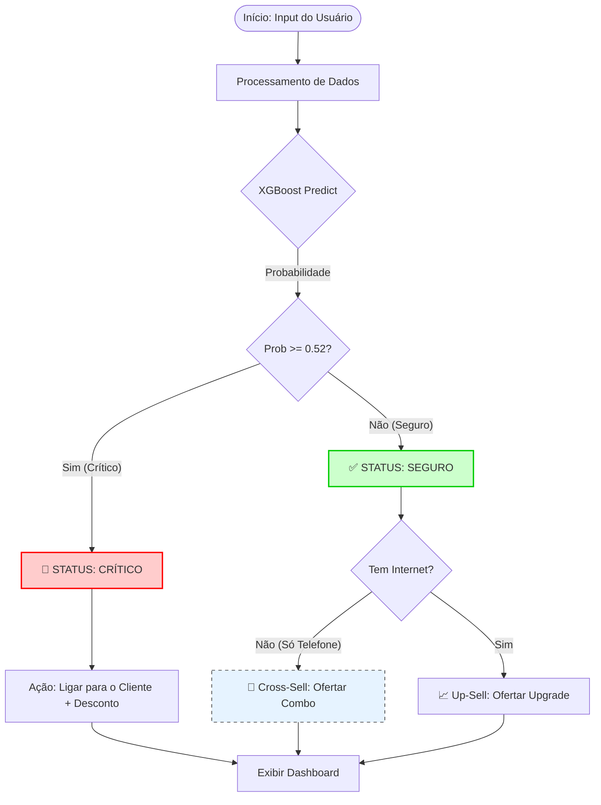
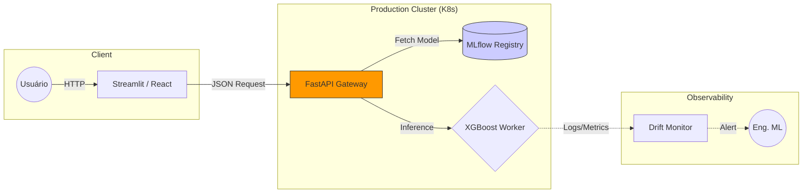

# 📡 Telco Customer Churn Prediction


## 💼 Sobre o Projeto

Este projeto apresenta uma solução completa End-to-End de Machine Learning para previsão de Churn de clientes em uma empresa de Telecomunicações.

O objetivo foi arquitetar um sistema de Machine Learning pronto para uso real, focado em suporte à decisão de negócio, permitindo que equipes de retenção atuem de forma proativa, orientada a dados e impacto financeiro (ROI).

📘 Contexto acadêmico-profissional
Projeto desenvolvido no contexto da disciplina Arquitetura de Software para Machine Learning, da Pós-Graduação em Engenharia de Machine Learning, com foco em engenharia de sistemas, ciclo de vida de modelos e decisão de negócio.

---

### 🧠 A Estratégia de Negócio

A **TELCON Customer Intelligence** utiliza Machine Learning para:
* Identificar clientes com alto risco de saída (Churn).
* Estimar o impacto financeiro mensal (MRR) e total (LTV).
* Recomendar ações personalizadas (Retenção, Cross-sell ou Upsell).

**🎯 Destaque Técnico:**

A decisão de corte (threshold) do modelo não foi arbitrária (padrão 0.50).

Foi realizada uma Análise de Curva de Lucro, identificando que o ponto de decisão ideal para maximizar o retorno financeiro da operação era 0.52, integrando diretamente métricas de negócio à arquitetura do sistema.

---

## 🎯 Resultados Alcançados

* **Recall de 79%:** O modelo identifica a maior parte dos clientes que efetivamente cancelariam o serviço;
* **Aumento de Lucro:** A adoção do threshold otimizado projetou um ganho superior a R$ 4.000,00/mês, quando comparado à estratégia padrão (simulação em base de teste);
* **Interface Otimizada:** redução do tempo de análise do operador por meio de um dashboard visual, objetivo e orientado à ação.

---

## 🧠 Lógica de Decisão (Pipeline)

O sistema não entrega apenas uma probabilidade bruta. Ele executa uma lógica de decisão baseada em regras de negócio, combinando score de risco e perfil do cliente para definir a ação recomendada.



---
## 📊 O Dashboard (Streamlit)

O projeto inclui uma interface web interativa, onde gestores podem simular perfis de clientes e receber diagnósticos em tempo real.

A aplicação consome artefatos de modelo persistidos, garantindo inferência rápida e desacoplada do processo de treino.


**Funcionalidades da Interface:**
1.  **Dashboard de decisão:** layout sem rolagem vertical, com cards de altura equalizada para leitura rápida;
2.  **Score de Risco:** Classificação visual (Seguro vs Crítico) com velocímetro interativo;
3.  **Sistema de Recomendação automática:** Sugestões acionáveis baseadas no perfil do cliente, (ex: "Oferecer Combo Fibra+TV" para clientes que só têm telefone).
4.  **UX/UI:** Design limpo (Modo Claro), orientado ao usuário de negócio.

---

## 🖥️ Tecnologias Utilizadas

* **Linguagem:** Python
* **Machine Learning:** XGBoost, Scikit-Learn
* **Dados:** Pandas, Numpy
* **Visualização:** Plotly, Matplotlib
* **Web App:** Streamlit
* **Estilização:** CSS Customizado (Flexbox & Grid Layout)
* **Persistência:** Joblib

---

## 💻 Como Executar Localmente

1. Clone o repositório:
```bash
git clone https://github.com/Kudo-San/Telco_Churn_project.git
```

2. Instale as dependências:
```bash
pip install -r requirements.txt
```

Execute o app:
```bash
streamlit run app.py
```

---

## 🔮 Evolução da Arquitetura (Roadmap)

Este projeto representa a implementação do **Ciclo 1 (MVP)** de uma solução de Data Science, com foco na validação da hipótese de negócio, usabilidade por times táticos e entrega rápida de valor.

Como parte da análise crítica exigida na disciplina de **Arquitetura de Software para Machine Learning**, foi elaborado um roadmap de evolução técnica, descrevendo como esta solução poderia ser refatorada para uma arquitetura distribuída baseada em microsserviços, adequada a ambientes corporativos de alta volumetria e baixa latência.

A tabela abaixo compara a arquitetura atual (acadêmica/MVP) com a arquitetura alvo (produtiva), evidenciando os pontos de desacoplamento necessários e a prontidão técnica do sistema para evolução:

| Componente | Arquitetura Atual (MVP) | Arquitetura Futura (Ideal) | Motivo da Evolução |
| :--- | :--- | :--- | :--- |
| **Backend** | Acoplado no Streamlit | **FastAPI / Flask** | Desacoplar a inferência da interface visual. |
| **Model Serving** | `joblib.load()` local | **MLflow Registry + KServe** | Versionamento de modelos e rollback controlado. |
| **Monitoramento** | Logs locais | **Prometheus + Grafana** | Detecção de *Data Drift*, performance e latência. |
| **Infraestrutura** | Streamlit Cloud | **Docker + Kubernetes** | Escalabilidade horizontal e alta disponibilidade. |

###  Diagrama de Arquitetura Futura (Target)



---

### 👨‍💻 Autor
Desenvolvido por Marcelo Kudo
