# 📡 Telco Customer Churn Prediction


## 💼 Sobre o Projeto

Este projeto é uma solução completa (End-to-End) desenvolvida para prever a rotatividade de clientes (Churn) em uma empresa de Telecomunicações.

O objetivo não foi apenas treinar um modelo, mas criar uma **ferramenta de suporte à decisão** que permitisse à equipe de retenção identificar clientes em risco e agir preventivamente, focando no impacto financeiro (ROI).

### 🧠 A Estratégia de Negócio

A **TELCON Customer Intelligence** utiliza Machine Learning para:
* Identificar clientes com alto risco de saída.
* Estimar o impacto financeiro mensal (MRR) e total (LTV).
* Recomendar ações personalizadas (Retenção, Cross-sell ou Upsell).

**Destaque Técnico:**
A decisão de corte (threshold) não foi arbitrária (padrão 0.50). Realizamos uma análise de **Curva de Lucro**, identificando que o ponto de corte ideal para maximizar o retorno financeiro da operação era **0.52**.

---

## 🎯 Resultados Alcançados

* **Recall de 79%:** O modelo identifica a grande maioria dos clientes em risco real.
* **Aumento de Lucro:** A implementação do threshold otimizado projetou um ganho superior à estratégia padrão em **R$ 4.000,00/mês** (simulação em base de teste).
* **Interface Otimizada:** Redução do tempo de análise do operador com um dashboard visual e direto.

---

## 🧠 Lógica de Decisão (Pipeline)

O sistema não entrega apenas uma probabilidade, ele toma decisões baseadas no perfil do cliente:

```mermaid
flowchart TD
    Start([Início: Input do Usuário]) --> Process[Processamento de Dados]
    Process --> Model{XGBoost Predict}
    Model -->|Probabilidade| Decisao{Prob >= 0.52?}
    
    Decisao -- Sim (Crítico) --> Red[🚨 STATUS: CRÍTICO]
    Red --> Action1[Ação: Ligar para o Cliente + Desconto]
    
    Decisao -- Não (Seguro) --> Green[✅ STATUS: SEGURO]
    Green --> CheckProd{Tem Internet?}
    
    CheckProd -- Não (Só Telefone) --> CrossSell[🎯 Cross-Sell: Ofertar Combo]
    CheckProd -- Sim --> UpSell[📈 Up-Sell: Ofertar Upgrade]

    Action1 --> Dashboard[Exibir Dashboard]
    CrossSell --> Dashboard
    UpSell --> Dashboard
    
    style Red fill:#ffcccc,stroke:#ff0000,stroke-width:2px
    style Green fill:#ccffcc,stroke:#00cc00,stroke-width:2px
    style CrossSell fill:#e6f3ff,stroke:#333,stroke-dasharray: 5 5
```



---
## 📊 O Dashboard (Streamlit)

O projeto inclui uma interface gráfica onde o gestor pode simular perfis e receber diagnósticos em tempo real.


**Funcionalidades da Interface:**
1.  **Dashboard de decisão:** Layout sem rolagem, com cards de altura equalizada para leitura rápida.
2.  **Score de Risco:** Classificação visual (Seguro vs Crítico) com velocímetro interativo.
3.  **Sistema de Recomendação:** Sugestão automática de ações (ex: "Oferecer Combo Fibra+TV" para clientes que só têm telefone).
4.  **UX/UI:** Design limpo (Modo Claro), com o foco na experiência do usuário de negócios.

---

## 🖥️ Tecnologias Utilizadas

* **Linguagem:** Python
* **Machine Learning:** XGBoost, Scikit-Learn
* **Dados:** Pandas, Numpy
* **Visualização:** Plotly, Matplotlib
* **Web App:** Streamlit
* **Estilização:** CSS Customizado (Flexbox & Grid Layout)
* **Persistência:** Joblib

---

## 💻 Como Executar Localmente

1. Clone o repositório:
```bash
git clone [https://github.com/SEU_USUARIO/telco-churn-project.git](https://github.com/SEU_USUARIO/telco-churn-project.git)
```

2. Instale as dependências:
```bash
pip install -r requirements.txt
```

Execute o app:
```bash
streamlit run app.py
```

---

### 👨‍💻 Autor
Desenvolvido por Marcelo Kudo
